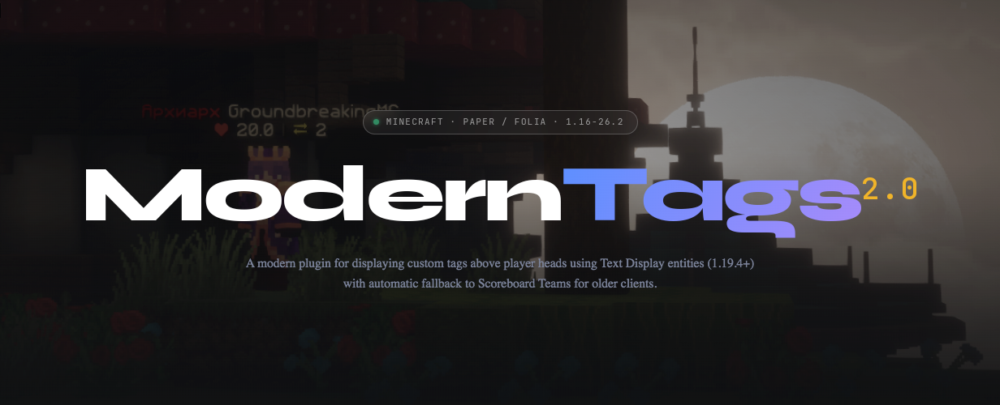

# ModernTags



A modern plugin for displaying custom tags above player heads using Text Display entities (1.19.4+) with automatic
fallback to Scoreboard Teams for older clients.

## Core Features

- **Tag customization** — full control over tag appearance (color, shadows, transparency, alignment, scale, etc.)
- **Animated tags** — multiple frames with configurable transition speed
- **Dual renderer** — Text Display entities for 1.19.4+ clients; Scoreboard Teams for older clients, picked
  automatically per viewer
- **Condition system** — `owner-conditions` and `viewer-conditions` let you select the right tag group with arbitrary
  logic (e.g. `hasPermission('moderntags.tag.vip')`)
- **Priority system** — tag groups and entries are sorted by priority; the highest-priority match wins
- **PlaceholderAPI integration** — any PAPI placeholder works out of the box
- **Vault integration** — automatic prefix/suffix insertion with optional MiniMessage parsing
- **Sneak dimming** — tags fade for crouching players on 1.19.4+ clients, matching vanilla behavior
- **TAB compatibility** — ModernTags 2.0 now manages Scoreboard Teams internally, so you do not need to disable TAB's own
  nametag display; this also fixes conflicts with glow plugins and other Scoreboard Teams consumers
- **Lock-free task queue** — events (player death, join, etc.) are enqueued and processed on the next tick, eliminating
  all concurrency issues

## Technical Highlights

- Built on **PacketEvents** — all rendering is done through packets, not bukkit APIs
- Component building via **[GikyMessage](https://github.com/groundbreakignmc/GikyMessage)** — reduces allocations and speeds up placeholder replacement
- Fully supports **Folia** (since 1.1) and all Paper forks (Paper, Purpur, etc.)

## Commands and Permissions

### Commands

| Command | Description |
|---|---|
| `/moderntags reload` | Reload plugin configuration |

### Permissions

| Permission | Description |
|---|---|
| `moderntags.tag.<name>` | Use a specific tag group (auto-generated per group) |
| `moderntags.see.own` | See your own tag |
| `moderntags.see.other` | See other players' tags |
| `moderntags.reload` | Access to the reload command |

## Placeholders

Placeholders support two contexts: `{owner:key}` resolves against the tag's target player, `{viewer:key}` resolves
against the observing player. This lets you show different tag content depending on who is looking.

### Built-in

| Placeholder | Description |
|---|---|
| `{owner:name}` | Tag owner's name |
| `{owner:display_name}` | Tag owner's display name |
| `{owner:health}` | Tag owner's health |
| `{owner:prefix}` | Tag owner's prefix from Vault |
| `{owner:suffix}` | Tag owner's suffix from Vault |
| `{viewer:name}` | Viewer's name |
| `{viewer:display_name}` | Viewer's display name |
| `{viewer:health}` | Viewer's health |
| `{viewer:prefix}` | Viewer's prefix from Vault |
| `{viewer:suffix}` | Viewer's suffix from Vault |

### PlaceholderAPI

Any PAPI expansion is supported via `{owner:EXPANSION_PLACEHOLDER}` or `{viewer:EXPANSION_PLACEHOLDER}`, for example:

- `{owner:player_level}` — tag owner's level
- `{viewer:player_ping}` — viewer's ping
- `{owner:vault_rank}` — tag owner's rank

## Configuration

### `config.yml`

```yaml
# Whether to parse Vault prefix/suffix placeholders using MiniMessage.
# If false, they are treated as legacy (&-formatted) strings.
vault-mm-formatting: false

# Hide the tag when the player has passengers (e.g., another player riding them).
hide-tag-when-has-passenger: true

# How often (in milliseconds) ModernTags should tick.
tick-rate: 50

# Settings for the legacy below-name objective (shown to all clients).
legacy-general:
  below-name-value: "owner:health"   # do not use {} here
  below-name-text: "&c❤"

# Tag groups — sorted by priority (highest wins).
# owner-conditions  — evaluated once per tag owner
# viewer-conditions — evaluated per viewer
#
# Client version selection (TextDisplay vs Scoreboard Teams) is automatic:
# each tag file contains both "modern" and "legacy" sections.
tags:
  - priority: 0
    entries:
      - priority: 0
        modern: tags/default.yml:<root>
        legacy: tags/default-legacy.yml:<root>

  - priority: 1
    owner-conditions: "hasPermission('moderntags.tag.vip')"
    entries:
      - priority: 0
        modern: tags/vip.yml:modern
        legacy: tags/vip.yml:legacy
```

### Modern tag file (`tags/default.yml`)

Used for clients **1.19.4 and above** (Text Display entities).

```yaml
# Frame transition rate (in ticks), -1 to disable animation
frame-update-rate: -1
# Placeholder update rate (in ticks)
placeholders-update-rate: 10

frames:
  - text: |-
      {owner:prefix}&r{owner:name}{owner:suffix}
      &c❤&f{owner:health}

    # Position offsets (float)
    x-offset: 0.0
    y-offset: 0.15
    z-offset: 0.0

    # Scale (float)
    scale: 1.0

    # Opacity when the owner is sneaking (-128 to 127)
    sneak-text-opacity: 60

    # Brightness: "block-<0-15>" or "sky-<0-15>"
    brightness: "block-15"

    # View range in blocks (float)
    view-range: 1.0

    # Shadow
    shadowed: true
    shadow-radius: 0.0
    shadow-strength: 1.0

    # Background color: #RRGGBB or #AARRGGBB
    background-color: "#00000000"

    # Text opacity (-128 to 127, -1 = fully opaque)
    text-opacity: -1

    # Other
    line-width: 200
    vertical-billboard: false
    see-through: false
    default-background: false
    alignment: "CENTER"   # LEFT | CENTER | RIGHT
```

### Legacy tag file (`tags/default-legacy.yml`)

Used for clients **below 1.19.4** (Scoreboard Teams).

```yaml
frame-update-rate: -1
placeholders-update-rate: 10

# Keep the player's existing name color set by other plugins (e.g. glow plugins).
preserve-player-name-color: true

# Colors treated as "no color set" — the frame's name-color is used instead.
ignored-colors: [ "white" ]

frames:
  - prefix: "{owner:prefix}"
    name-color: "white"
    suffix: "{owner:suffix}"
```

### Combining modern and legacy in one file (`tags/vip.yml`)

```yaml
modern:
  frame-update-rate: 10
  placeholders-update-rate: 10
  frames:
    - text: |-
        &6★ {owner:prefix}&r&e{owner:name}{owner:suffix} &r&6★
        &c❤&f{owner:health}
    - text: |-
        &e✦ {owner:prefix}&r&e{owner:name}{owner:suffix} &r&e✦
        &c❤&f{owner:health}

legacy:
  frame-update-rate: 10
  placeholders-update-rate: 10
  preserve-player-name-color: true
  ignored-colors: [ "white" ]
  frames:
    - prefix: "&e✦ {owner:prefix}"
      name-color: "yellow"
      suffix: "{owner:suffix} &e✦"
    - prefix: "&6★ {owner:prefix}"
      name-color: "yellow"
      suffix: "{owner:suffix} &6★"
```

### Frame parameters (modern)

| Parameter | Type | Default | Description |
|---|---|---|---|
| `text` | string | — | Tag text; supports legacy `&` formatting and `{owner:*}` placeholders |
| `x-offset` | float | `0.0` | X-axis offset |
| `y-offset` | float | `0.15` | Y-axis offset |
| `z-offset` | float | `0.0` | Z-axis offset |
| `scale` | float | `1.0` | Tag scale |
| `sneak-text-opacity` | int | `60` | Opacity when owner is sneaking (-128–127) |
| `text-opacity` | int | `-1` | Text opacity (-128–127; -1 = fully opaque) |
| `brightness` | string | `"block-15"` | `"block-<0-15>"` or `"sky-<0-15>"` |
| `view-range` | float | `1.0` | View range in blocks |
| `shadowed` | bool | `true` | Render text shadow |
| `shadow-radius` | float | `0.0` | Shadow radius |
| `shadow-strength` | float | `1.0` | Shadow intensity |
| `background-color` | string | `"#00000000"` | Background in `#RRGGBB` or `#AARRGGBB` |
| `default-background` | bool | `false` | Use the standard Minecraft background |
| `line-width` | int | `200` | Maximum line width |
| `vertical-billboard` | bool | `false` | Vertical billboard mode |
| `see-through` | bool | `false` | Visible through blocks |
| `alignment` | string | `"CENTER"` | `LEFT`, `CENTER`, or `RIGHT` |

### Frame parameters (legacy)

| Parameter | Type | Description |
|---|---|---|
| `prefix` | string | Text shown before the player name (legacy formatting) |
| `name-color` | string | Player name color (e.g. `"yellow"`, `"white"`) |
| `suffix` | string | Text shown after the player name (legacy formatting) |

## Dependencies

### Required

- **PacketEvents** — packet-level rendering

### Optional

- **PlaceholderAPI** — placeholders from other plugins
- **Vault** — prefix and suffix support

## License

[Apache License Version 2.0, January 2004](LICENSE)
