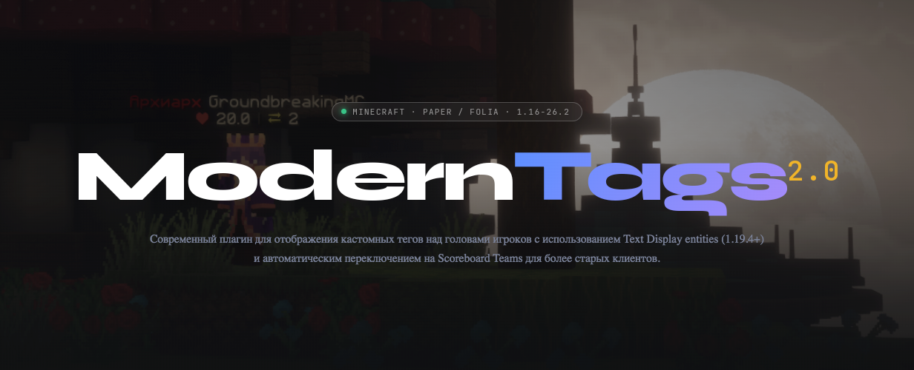

## Основной функционал

- **Кастомизация тегов** — полная настройка внешнего вида (цвет, тени, прозрачность, выравнивание, масштаб и т.д.)
- **Анимированные теги** — несколько фреймов с настраиваемой скоростью смены
- **Двойной рендерер** — Text Display entities для клиентов 1.19.4+; Scoreboard Teams для более старых клиентов,
  выбирается автоматически для каждого зрителя
- **Система условий** — `owner-conditions` и `viewer-conditions` позволяют выбирать группу тегов с произвольной
  логикой (например, `hasPermission('moderntags.tag.vip')`)
- **Система приоритетов** — группы и записи сортируются по приоритету; побеждает наибольший
- **Интеграция с PlaceholderAPI** — любой PAPI-плейсхолдер работает из коробки
- **Интеграция с Vault** — автоматическая вставка префикса/суффикса с поддержкой MiniMessage
- **Затемнение при приседании** — тег затемняется, когда владелец приседает, у зрителей на 1.19.4+, как в ванильном
  Minecraft
- **Совместимость с TAB** — ModernTags 2.0 теперь сам управляет Scoreboard Teams, поэтому отключать отображение тегов
  в TAB больше не нужно; это также устраняет конфликты с плагинами свечения и другими потребителями Scoreboard Teams
- **Очередь задач без блокировок** — события (смерть игрока, вход и т.д.) помещаются в очередь и обрабатываются на
  следующем тике, что полностью исключает проблемы с многопоточностью

## Технические преимущества

- Работает на **PacketEvents** — весь рендеринг через пакеты, без Bukkit API
- Сборка компонентов через **[GikyMessage](https://github.com/groundbreakignmc/GikyMessage)** — меньше аллокаций, быстрая замена плейсхолдеров
- Полная поддержка **Folia** (начиная с версии 1.1) и всех форков Paper (Paper, Purpur и др.)

## Команды и права

### Команды

| Команда | Описание |
|---|---|
| `/moderntags reload` | Перезагрузить конфигурацию плагина |

### Права

| Право | Описание |
|---|---|
| `moderntags.see.own` | Видимость собственного тега |
| `moderntags.reload` | Доступ к команде перезагрузки |

## Плейсхолдеры

Плейсхолдеры поддерживают два контекста: `{owner:key}` разрешается относительно владельца тега, `{viewer:key}` —
относительно наблюдающего игрока. Это позволяет показывать разное содержимое тега в зависимости от того, кто смотрит.

### Встроенные

| Плейсхолдер | Описание |
|---|---|
| `{owner:name}` | Имя владельца тега |
| `{owner:display_name}` | Отображаемое имя владельца тега |
| `{owner:health}` | Здоровье владельца тега |
| `{owner:prefix}` | Префикс владельца тега из Vault |
| `{owner:suffix}` | Суффикс владельца тега из Vault |
| `{viewer:name}` | Имя наблюдателя |
| `{viewer:display_name}` | Отображаемое имя наблюдателя |
| `{viewer:health}` | Здоровье наблюдателя |
| `{viewer:prefix}` | Префикс наблюдателя из Vault |
| `{viewer:suffix}` | Суффикс наблюдателя из Vault |

### PlaceholderAPI

Любое расширение PAPI поддерживается через `{owner:EXPANSION_PLACEHOLDER}` или `{viewer:EXPANSION_PLACEHOLDER}`,
например:

- `{owner:player_level}` — уровень владельца тега
- `{viewer:player_ping}` — пинг наблюдателя
- `{owner:vault_rank}` — ранг владельца тега

## Конфигурация

### `config.yml`

```yaml
# Использовать MiniMessage для парсинга префикса/суффикса из Vault.
# Если false, строки обрабатываются как legacy (&-форматирование).
vault-mm-formatting: false

# Скрывать тег, когда на игроке есть пассажиры (например, другой игрок).
hide-tag-when-has-passenger: true

# Как часто (в миллисекундах) должен тикать ModernTags.
tick-rate: 50

# Настройки legacy-objective под именем (показывается всем клиентам).
legacy-general:
  below-name-value: "owner:health"   # фигурные скобки здесь не нужны
  below-name-text: "&c❤"

# Группы тегов — сортируются по приоритету (наибольший побеждает).
# owner-conditions  — вычисляется один раз для владельца тега
# viewer-conditions — вычисляется для каждого зрителя
#
# Выбор рендерера (TextDisplay или Scoreboard Teams) происходит автоматически:
# каждый файл тега содержит секции "modern" и "legacy".
tags:
  - priority: 0
    entries:
      - priority: 0
        modern: tags/default.yml:<root>
        legacy: tags/default-legacy.yml:<root>

  - priority: 1
    owner-conditions: "hasPermission('moderntags.tag.vip')"
    entries:
      - priority: 0
        modern: tags/vip.yml:modern
        legacy: tags/vip.yml:legacy
```

### Файл модерн-тега (`tags/default.yml`)

Используется для клиентов **1.19.4 и выше** (Text Display entities).

```yaml
# Скорость смены фреймов (в тиках), -1 — анимация отключена
frame-update-rate: -1
# Скорость обновления плейсхолдеров (в тиках)
placeholders-update-rate: 10

frames:
  - text: |-
      {owner:prefix}&r{owner:name}{owner:suffix}
      &c❤&f{owner:health}

    # Смещения позиции (float)
    x-offset: 0.0
    y-offset: 0.15
    z-offset: 0.0

    # Масштаб (float)
    scale: 1.0

    # Прозрачность при приседании владельца (-128 до 127)
    sneak-text-opacity: 60

    # Яркость: "block-<0-15>" или "sky-<0-15>"
    brightness: "block-15"

    # Дальность видимости в блоках (float)
    view-range: 1.0

    # Тень
    shadowed: true
    shadow-radius: 0.0
    shadow-strength: 1.0

    # Цвет фона: #RRGGBB или #AARRGGBB
    background-color: "#00000000"

    # Прозрачность текста (-128 до 127, -1 = полностью непрозрачный)
    text-opacity: -1

    # Прочее
    line-width: 200
    vertical-billboard: false
    see-through: false
    default-background: false
    alignment: "CENTER"   # LEFT | CENTER | RIGHT
```

### Файл legacy-тега (`tags/default-legacy.yml`)

Используется для клиентов **ниже 1.19.4** (Scoreboard Teams).

```yaml
frame-update-rate: -1
placeholders-update-rate: 10

# Сохранять цвет имени, установленный другими плагинами (например, плагинами свечения).
preserve-player-name-color: true

# Цвета, которые считаются «не установленными» — вместо них используется name-color фрейма.
ignored-colors: [ "white" ]

frames:
  - prefix: "{owner:prefix}"
    name-color: "white"
    suffix: "{owner:suffix}"
```

### Объединение modern и legacy в одном файле (`tags/vip.yml`)

```yaml
modern:
  frame-update-rate: 10
  placeholders-update-rate: 10
  frames:
    - text: |-
        &6★ {owner:prefix}&r&e{owner:name}{owner:suffix} &r&6★
        &c❤&f{owner:health}
    - text: |-
        &e✦ {owner:prefix}&r&e{owner:name}{owner:suffix} &r&e✦
        &c❤&f{owner:health}

legacy:
  frame-update-rate: 10
  placeholders-update-rate: 10
  preserve-player-name-color: true
  ignored-colors: [ "white" ]
  frames:
    - prefix: "&e✦ {owner:prefix}"
      name-color: "yellow"
      suffix: "{owner:suffix} &e✦"
    - prefix: "&6★ {owner:prefix}"
      name-color: "yellow"
      suffix: "{owner:suffix} &6★"
```

### Параметры фреймов (modern)

| Параметр | Тип | По умолчанию | Описание |
|---|---|---|---|
| `text` | string | — | Текст тега; поддерживает `&`-форматирование и плейсхолдеры `{owner:*}` |
| `x-offset` | float | `0.0` | Смещение по оси X |
| `y-offset` | float | `0.15` | Смещение по оси Y |
| `z-offset` | float | `0.0` | Смещение по оси Z |
| `scale` | float | `1.0` | Масштаб тега |
| `sneak-text-opacity` | int | `60` | Прозрачность при приседании владельца (-128–127) |
| `text-opacity` | int | `-1` | Прозрачность текста (-128–127; -1 = непрозрачный) |
| `brightness` | string | `"block-15"` | `"block-<0-15>"` или `"sky-<0-15>"` |
| `view-range` | float | `1.0` | Дальность видимости в блоках |
| `shadowed` | bool | `true` | Тень текста |
| `shadow-radius` | float | `0.0` | Радиус тени |
| `shadow-strength` | float | `1.0` | Интенсивность тени |
| `background-color` | string | `"#00000000"` | Фон в формате `#RRGGBB` или `#AARRGGBB` |
| `default-background` | bool | `false` | Стандартный фон Minecraft |
| `line-width` | int | `200` | Максимальная ширина строки |
| `vertical-billboard` | bool | `false` | Вертикальный billboard |
| `see-through` | bool | `false` | Видимость сквозь блоки |
| `alignment` | string | `"CENTER"` | `LEFT`, `CENTER` или `RIGHT` |

### Параметры фреймов (legacy)

| Параметр | Тип | Описание |
|---|---|---|
| `prefix` | string | Текст перед именем игрока (legacy-форматирование) |
| `name-color` | string | Цвет имени игрока (например, `"yellow"`, `"white"`) |
| `suffix` | string | Текст после имени игрока (legacy-форматирование) |

## Зависимости

### Обязательные

- **PacketEvents** — рендеринг через пакеты

### Опциональные

- **PlaceholderAPI** — плейсхолдеры из других плагинов
- **Vault** — поддержка префиксов и суффиксов

## Лицензия

[Apache License Version 2.0, January 2004](LICENSE)
